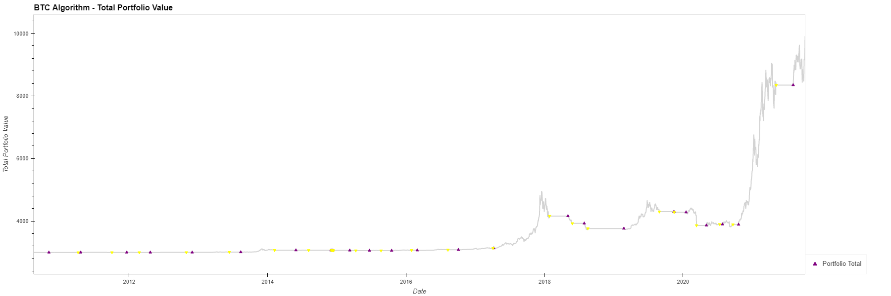
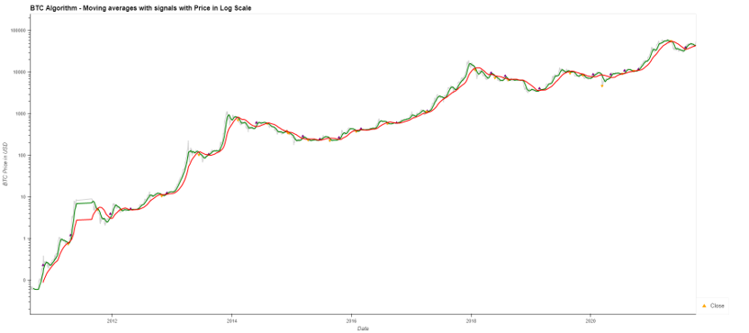

# Bitcoin Analysis (BTC)
## Background and Motivation
 * Our group had two main goals for this project. 
    * Our first goal was to find out which combination of moving averages       produced the best trading signals and portfolio performance.
    * The second goal was to figure out which type of model would best predict the price of Bitcoin. 
* Going into this we made no assumptions about which type of models to use, however we researched some of the most used models in crypto trading and tested them. 
* Models that we tested include LSTM, SVR, SVR-Tuned, Ridge and Lasso. 

## Moving Averages Analysis:
* We reviewed the entire Bitcoin dataset to find optimum moving average combinations. 
* We settled on using the Short Moving Average of 20 days and the Long Moving Average of 80 days. 
* Trading signals produced when Moving Averages cross these thresholds would generate a portfolio of ~$10K with an initial investment of $3K.
* Our signals were simply buy when the short crosses over the long moving average and sell when the short crosses below the long moving average.
* Volume or other inputs were not used in the signals, simply just the cross over points.

Here is a graph showing the portfolio value over time with buy signals in purple and sell signals in yellow:

Here is a graph of those same triggers with the moving averages plotted all on a logarithmic scale:

We ran some manual calculations of the RMSE and R2, which were based on the test data set. 

Results:

RMSE_LSTM = 0.280881
R2_LSTM = 0.051536

